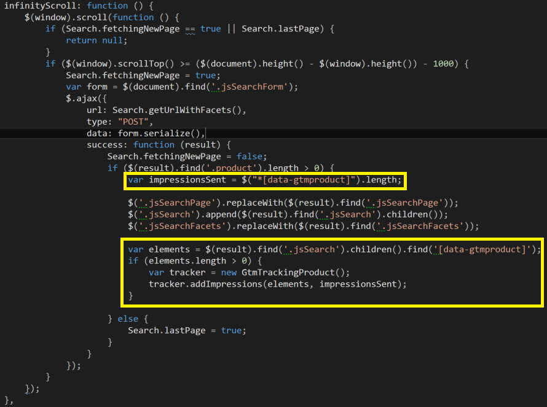

# QuickSilver examples

Here are more hands on examples using the module in an Episerver QuickSilver demo site.

## Generating the product json 
As specified in the [readme file](../README.md) : the implementation will look for attribute with name *'data-gtmproduct'* and expects the content of the attribute to be serlialized json product data.
The QuickSilver category list page renders _Product.cshtml (with IProductModel as the viewmodel) for each product item in the list.  
Notice the use of **LowercaseContractResolver** to ensure all lower case json. 

Example from _Product.cshtml:
```cshtml
@model EPiServer.Reference.Commerce.Site.Features.Shared.Models.IProductModel


<div class="@productLevelClass"  data-gtmproduct="@Html.RenderProductJson(Model)">
	<a href="@Model.Url" class="link--black">
		<!-- .... -->
	</a>
</div>
```
The html helper method:
```c#
public static IHtmlString RenderProductJson(this HtmlHelper htmlHelper, IProductModel productModel, decimal? quantity = null)
        {
            if (productModel == null)
            {
                return htmlHelper.Raw(string.Empty);
            }
            var product = new TrackingProduct()
            {
                Id = productModel.Code,
                Name = productModel.DisplayName,
                Price = productModel.DiscountedPrice.GetValueOrDefault().Amount,
                Brand = productModel.Brand,
                Category = productModel.Category
            };

            if (quantity != null)
                product.Quantity = quantity.Value;

            var settings = new JsonSerializerSettings { ContractResolver = new LowercaseContractResolver() };
            return htmlHelper.Raw(JsonConvert.SerializeObject(product, settings));
        }
```

This would typically result in html similar to this:

```html
<!-- a product item in the category list -->
<div class="product" data-gtmproduct="{"id":"P-38426422","name":"Short Sleeve Crew Tee",
      "price":30.5,"category":null,"brand":"Fruit of the Loom","variant":null,"position":0,"quantity":0}">
    <a href="/en/fashion/womens/womens-tees/p-38426422/" class="link--black">
        <!-- .... -->
    </a>
</div>
```

## Handling autoscroll and product impressions
The QuickSilver demo site loads more products into a category page using auto scroll functionality. This is handled by the **infinityScroll** function inside Search.js. Below is an example of how you can track the new products fetched from the server, by adding a few lines (the yellow ones) to Search.js:


